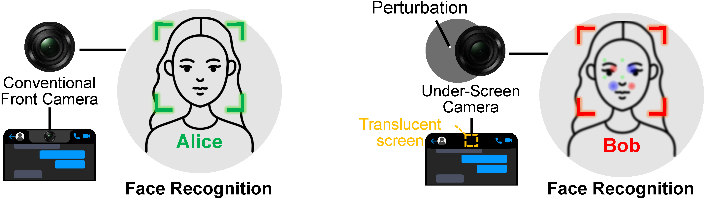
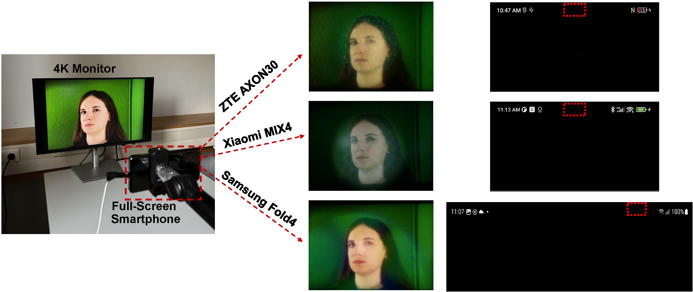

<h1 align="center"> Screen Perturbation: Adversarial Attack and Defense on Under-Screen Camera</h1>

This repository is the official implementation of "[Screen Perturbation: Adversarial Attack and Defense on Under-Screen Camera](https://doi.org/10.1145/3570361.3613278)"
in the ACM Conference on Mobile Computing And Networking (MobiCom) 2023 




## Introduction
Smartphones are moving towards the fullscreen design for better user experience. This trend forces front cameras to be placed under screen, leading to Under-Screen Cameras (USC). Accordingly, a small area of the screen is made translucent to allow light to reach the USC. In this paper, we utilize the translucent screen's features to inconspicuously modify its pixels, imperceptible to human eyes but inducing perturbations on USC images. These screen perturbations affect deep learning models in image classification and face recognition. They can be employed to protect user privacy, or disrupt the front camera's functionality in the malicious case. We design two methods, one-pixel perturbation and multiple-pixel perturbation, that can add screen perturbations to images captured by USC and successfully fool various deep learning models. Our evaluations, with three commercial full-screen smartphones on testbed datasets and synthesized datasets, show that screen perturbations significantly decrease the average image classification accuracy, dropping from 85% to only 14% for one-pixel perturbation and 5.5% for multiple-pixel perturbation. For face recognition, the average accuracy drops from 91% to merely 1.8% and 0.25%, respectively.

## Dependencies
First, please install the required packages by executing the command below:
```
pip install -r requirements.txt
```

## Embed screen perturbation into the existing dataset
We built an under-screen camera imaging model to evaluate how the proposed screen perturbations affect deep learning models' decisions. To apply screen perturbations to an existing image dataset, follow the steps below for each task:

* ### Image classification task:

Please download the [miniImageNet](https://www.kaggle.com/datasets/arjunashok33/miniimagenet) dataset. Then run the command below to generate the corresponding perturbed images:
```
python add_perturbation_synthesized.py
```
If you want to apply an image restoration algorithm (e.g., a deblurring step) to the perturbed images, run:
```
python add_perturbation_synthesized_deblurred.py
```
* ### Face recogniztion task:

Please download the [FaceScrub](https://vintage.winklerbros.net/facescrub.html) dataset. Then run the command below to generate the corresponding perturbed face images:
```
python add_perturbation_synthesized_face.py
```
To include the restoration step for face images, run:
```
python add_perturbation_synthesized_face_deblurred.py
```

## Embed screen perturbation into the practical captured dataset
We set up a testbed to capture real images using USC smartphones. As shown in the figure below, the testbed consists of a 4K LCD monitor displaying pristine images and three commercial off-the-shelf smartphones with under-screen cameras: the Samsung Fold4, ZTE Axon 30, and Xiaomi MIX4. The figure also includes screenshots of each phone's status bar while generating a one-pixel perturbation. As highlighted by the red dotted rectangles, the changes to the screen pixels in the TSR are imperceptible to the human eye. Additionally, the pattern of screen perturbations differs across the devices due to their different screen layouts.



All the high-resolution full-face images used on the 4K monitor are from the [XGaze](https://ait.ethz.ch/xgaze) dataset. To embed screen perturbations into the captured images from our testbed, use the following commands:

* ### One-pixel screen perturbation:
```
python add_perturbation_smartphone_onepixel.py
```
* ### Multiple-pixel screen perturbation:
```
python add_perturbation_smartphone_allpixels.py
```
* ### Baseline images (no perturbation, display turned off):
```
add_perturbation_smartphone_displayoff.py
```


## Citation

If our work is useful for your research, please consider citing it:

```
@inproceedings{ye2023screen,
  title={Screen Perturbation: Adversarial Attack and Defense on Under-Screen Camera},
  author={Ye, Hanting and Lan, Guohao and Jia, Jinyuan and Wang, Qing},
  booktitle={Proceedings of the ACM Conference on Mobile Computing And Networking (MobiCom)},
  year={2023}
}
```