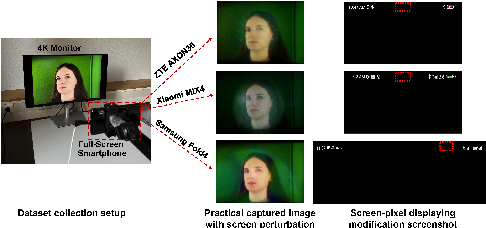

<h1 align="center"> Screen Perturbation: Adversarial Attack and Defense on Under-Screen Camera</h1>

This repository is the official implementation of "[Screen Perturbation: Adversarial Attack and Defense on Under-Screen Camera](https://doi.org/10.1145/3570361.3613278)"
in the ACM Conference on Mobile Computing And Networking (MobiCom) 2023 


## Introduction
Smartphones are moving towards the fullscreen design for better user experience. This trend forces front cameras to be placed under screen, leading to Under-Screen Cameras (USC). Accordingly, a small area of the screen is made translucent to allow light to reach the USC. In this paper, we utilize the translucent screen's features to inconspicuously modify its pixels, imperceptible to human eyes but inducing perturbations on USC images. These screen perturbations affect deep learning models in image classification and face recognition. They can be employed to protect user privacy, or disrupt the front camera's functionality in the malicious case. We design two methods, one-pixel perturbation and multiple-pixel perturbation, that can add screen perturbations to images captured by USC and successfully fool various deep learning models. Our evaluations, with three commercial full-screen smartphones on testbed datasets and synthesized datasets, show that screen perturbations significantly decrease the average image classification accuracy, dropping from 85% to only 14% for one-pixel perturbation and 5.5% for multiple-pixel perturbation. For face recognition, the average accuracy drops from 91% to merely 1.8% and 0.25%, respectively.

## SWebCSK constellation point computation
Run the `Constellation_Calculation_M-SWebCSK.m` file to generate all the corresponding color coordinates for the M-SWebCSK modulation information, where `x_primary` and `y_primary` store the three color coordinates of the RGB LED at the transmitter, and `M` represents the modulation order.



## Control SWebCSK generation
By collecting the intensity of each R, G, B channel of the RGB LED at different duty cycles, run `Tx_fitting_LEDdata.m` to fit the duty cycle combination of the RGB LED required by SWebCSK.


## Implementation
For the experimental setup, please prepare three Arduinos (one for TX, one for the transparent screen, and one for RX) and install the Arduino IDE. The Transmitter and Receiver codes in `implementation/` are used to modulate and send information, and the AS73211 color sensor placed behind the transparent screen is used to receive data. Finally, all data demodulation and information recovery are performed using the `Constellation point design and the demodulation/` `Receiver.m` code.

## Citation

If SpiderWeb is useful for your research, please consider citing it:

```
@inproceedings{ye2021spiderweb,
  title={Spiderweb: Enabling through-screen visible light communication},
  author={Ye, Hanting and Wang, Qing},
  booktitle={Proceedings of the ACM Conference on Embedded Networked Sensor Systems (SenSys)},
  year={2021}
}
```